## Churn Prediction in Telecom Industry

This repository implements a complete machine learning pipeline to predict telecom customer churn using classic supervised learning algorithms. It includes data download from Kaggle, preprocessing, model training, evaluation, and CLI entry points.

### Dataset
- Source: `https://www.kaggle.com/datasets/mnassrib/telecom-churn-datasets`

### Project Structure
```
.
├── .github/workflows/ci.yml        # CI for lint and tests
├── .gitignore
├── .gitattributes
├── LICENSE
├── Makefile
├── README.md
├── requirements.txt
├── scripts/
│   └── download_data.py           # Kaggle download
├── src/
│   └── churn/
│       ├── __init__.py
│       ├── cli.py                 # CLI entrypoints
│       ├── config.py              # Paths, constants
│       ├── data.py                # Load & preprocess
│       ├── evaluate.py            # Metrics & plots
│       ├── explain.py             # SHAP interpretability
│       └── models.py              # Model training
├── tests/
│   └── test_preprocess.py
├── data/
│   ├── raw/.gitkeep
│   └── processed/.gitkeep
├── models/.gitkeep
└── reports/.gitkeep
```

### Project Overview

Customer churn is when a telecom subscriber leaves one service provider for another. Predicting churn is essential for telecom companies to reduce customer losses, intervene proactively, and boost revenue.
We utilize the Kaggle Telecom Churn Dataset, combining all provided CSVs for training and evaluation.
Churn prediction enables targeted retention strategies, reducing customer loss and increasing business profitability in highly competitive telecom markets.

### Dataset Description

- **Source:** [Kaggle - Telecom Churn Dataset](https://www.kaggle.com/datasets/mnassrib/telecom-churn-datasets)
- **Size, key features:**
  - ~7,000 samples, 21 features (demographics, account information, call usage, etc.)
  - Binary churn label: `Churn` (Yes/No)
- **Preprocessing steps:**
  - All CSVs merged into a single DataFrame
  - Removed customer ID columns
  - Normalized categorical variables
  - Handled inconsistent/missing values (e.g., `TotalCharges` coerced to numeric)
  - Stratified train/test split
  - Preprocessing pipeline: imputation, scaling of numerics, one-hot-encoding for categoricals

### Modeling Approach

- **Algorithms tried:** Logistic Regression, Random Forest, XGBoost
- **Feature engineering / transformations:** Minimal feature engineering with robust preprocessing pipelines (numeric scaling, categorical one-hot encoding). Hyperparameters tuned via cross-validated grid search optimizing ROC-AUC.

### Results Summary ✅

Best-performing model: **Random Forest**

- **Accuracy:** 0.9340
- **Precision:** 0.9818
- **Recall:** 0.5567
- **F1-score:** 0.7105
- **ROC-AUC:** 0.9297

Confusion Matrices: 
Logistic Regression Matrix:
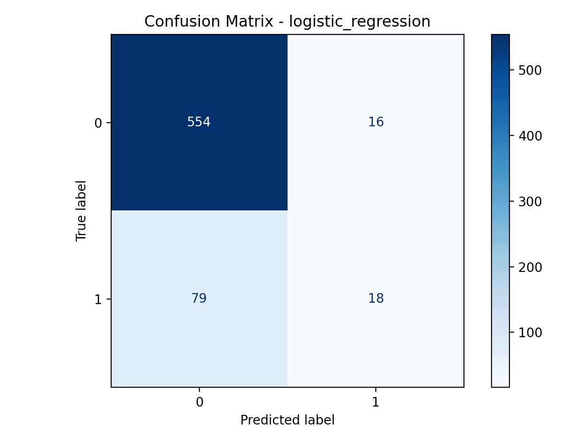
Logistic Regression ROC curve:
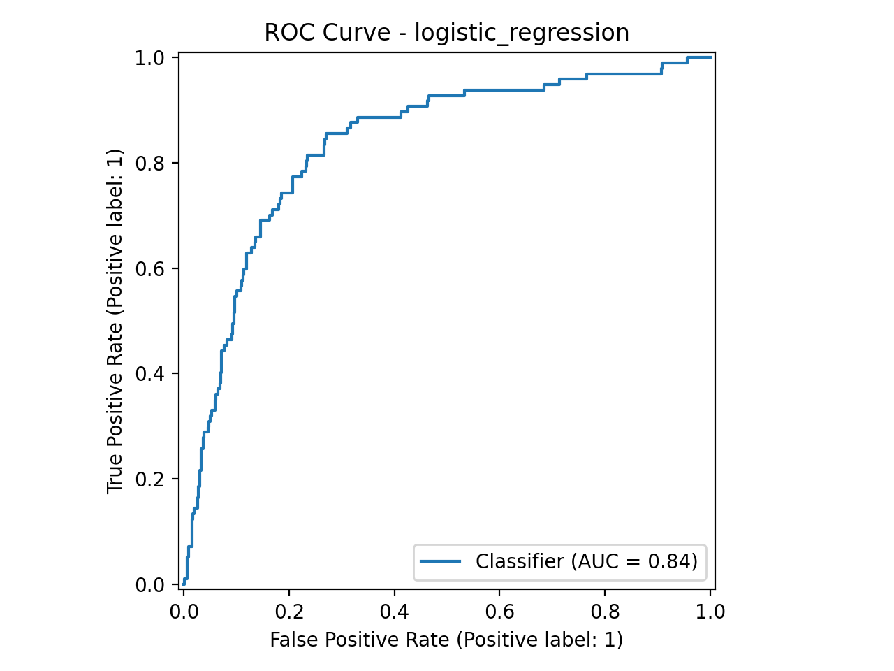
Random Forest Matrix: 
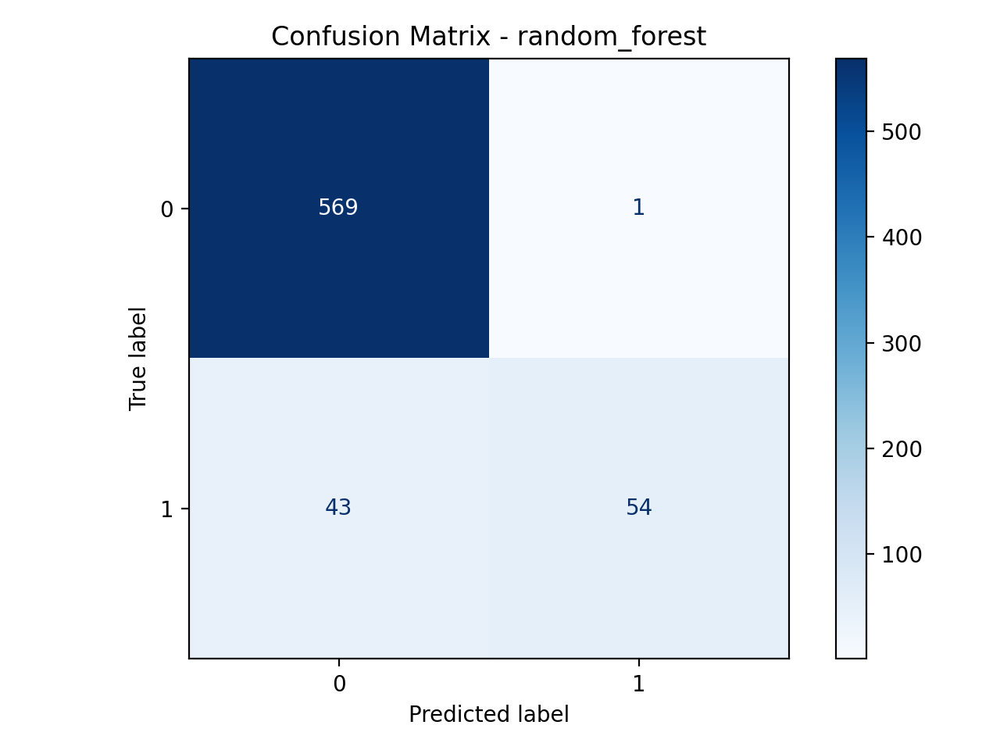
Random Forest ROC curve: 
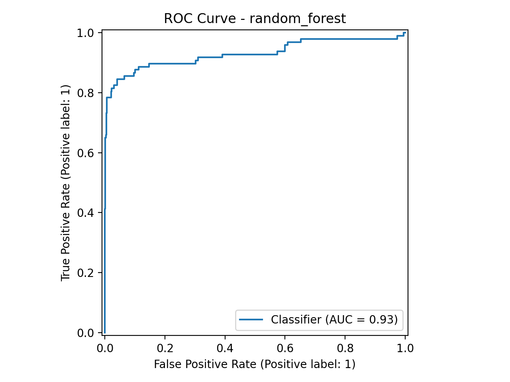
XGBoost Matrix: 
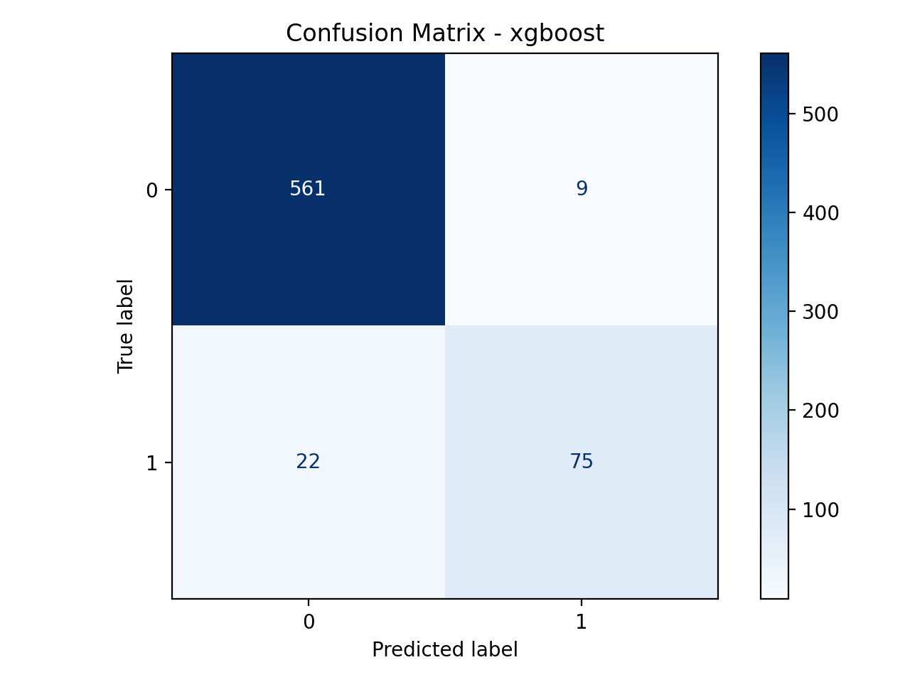
XGBoost ROC curve: 
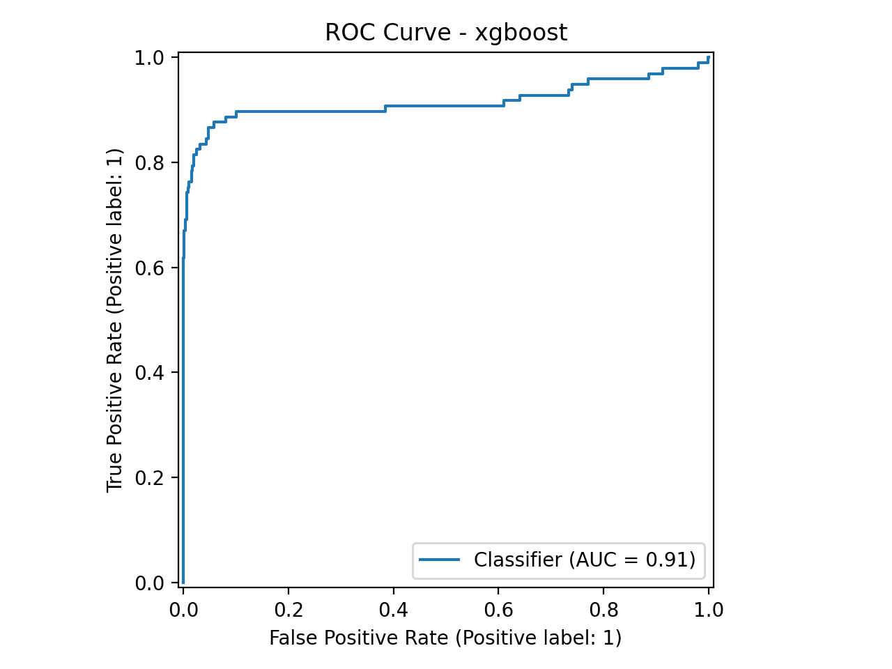

_Summary: Model correctly identified ~56% of churners (positives) and ~100% of non-churners (negatives)._

### Interpretation / Insights

- **What do the results mean?** The model is highly precise when it predicts churn (few false positives) but has moderate recall on churners (some churners are missed). Non-churned customers are classified extremely well.
- **Any surprising findings?** Churners, being a minority, are harder to detect; class imbalance and overlapping patterns likely reduce recall.
- **What could be improved?**
  - Increase recall with class balancing (e.g., SMOTE), cost-sensitive learning, or threshold tuning
  - Explore richer feature engineering, interaction terms, and calibration
  - Try advanced ensembles or stacking and conduct feature importance analysis for business insights

### Model Comparison and Choice

I tested Logistic Regression, Random Forest, and XGBoost with the same preprocessing. Random Forest delivered the best overall trade‑off, achieving the highest ROC‑AUC and strong accuracy while keeping precision high. Logistic Regression underfit nonlinearities and interactions, and  XGBoost did not outperform Random Forest with this feature set and dataset size. The Random Forest’s ability to model interactions and heterogeneous effects without heavy feature engineering made it the most reliable option here.

---

### Model Interpretability with SHAP

Implemented **SHAP (SHapley Additive exPlanations)** values to generate global and local interpretability plots, isolating **"Fiber Optic Service"** and **"Monthly Charges"** as primary drivers of customer attrition.

SHAP values decompose each prediction into per-feature contributions, answering *"how much did each feature push this customer toward or away from churn?"* for every individual prediction.

#### Global Feature Importance (mean |SHAP|)

The bar chart ranks all features by their average absolute SHAP impact across the entire test set:

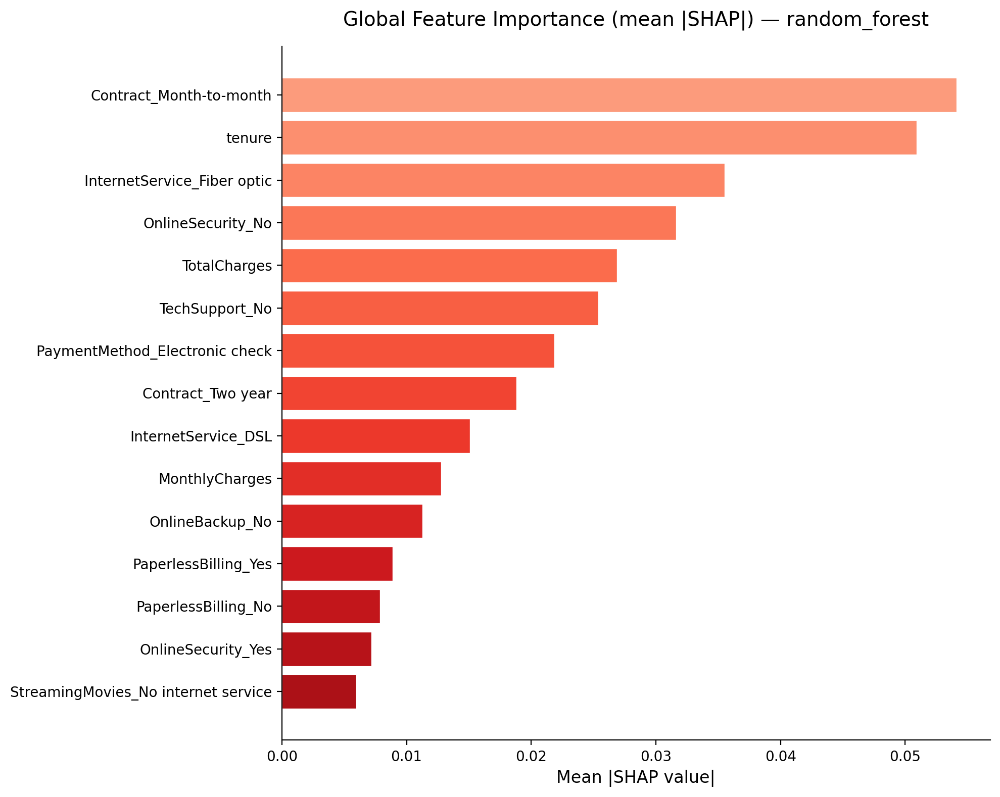

**Top churn drivers:**

| Rank | Feature | Mean \|SHAP\| | Interpretation |
|------|---------|--------------|----------------|
| 1 | Contract (Month-to-month) | 0.0541 | Customers without long-term contracts are the strongest churn signal |
| 2 | Tenure | 0.0509 | Newer customers are at significantly higher risk |
| 3 | InternetService (Fiber optic) | 0.0355 | **Fiber optic subscribers churn disproportionately** |
| 4 | OnlineSecurity (No) | 0.0316 | Lack of security add-on correlates with higher churn |
| 5 | TotalCharges | 0.0269 | Lower lifetime spend indicates higher churn risk |
| 6 | TechSupport (No) | 0.0254 | No tech support amplifies churn probability |
| 7 | PaymentMethod (Electronic check) | 0.0219 | Electronic check users churn more than auto-pay |
| 8 | Contract (Two year) | 0.0188 | Long-term contracts strongly protect against churn |
| 9 | InternetService (DSL) | 0.0151 | DSL users churn less than fiber optic users |
| 10 | **MonthlyCharges** | **0.0128** | **Higher monthly bills increase churn probability** |

#### Bee-Swarm Summary Plot

Each dot is one customer. Color indicates feature value (red = high, blue = low). Position on the x-axis shows the SHAP impact on churn prediction:

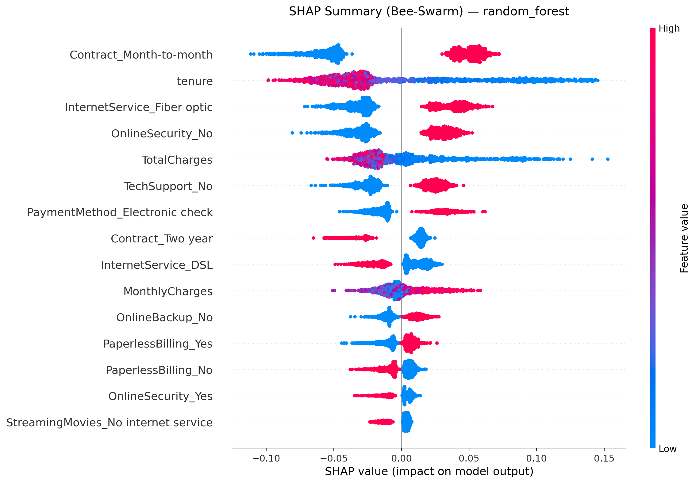

**Key insights from the bee-swarm:**
- **Contract_Month-to-month = 1** (red dots, right side): Having a month-to-month contract strongly pushes the model toward predicting churn
- **Tenure**: Low tenure values (blue dots, right side) push toward churn; high tenure (red, left) protects against it
- **InternetService_Fiber optic = 1** (red, right): Fiber optic service consistently increases churn risk
- **MonthlyCharges**: Higher values (red, right) increase churn prediction

#### SHAP Dependence Plots — Key Drivers

##### Fiber Optic Service
Fiber optic subscribers show a clear upward SHAP shift, indicating the model consistently predicts higher churn risk for this group compared to DSL or no-internet customers:

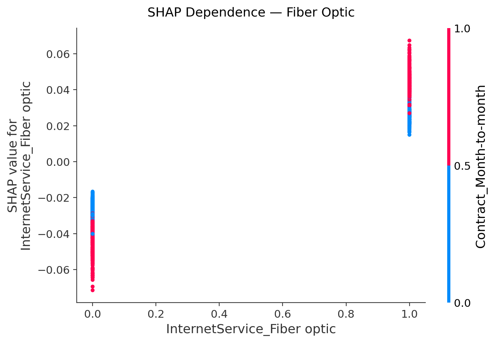

##### Monthly Charges
A clear positive relationship: as monthly charges increase, SHAP values rise, pushing the model toward churn. The interaction with TotalCharges (color) reveals that high monthly charges with low total charges (new, expensive customers) are the highest risk:

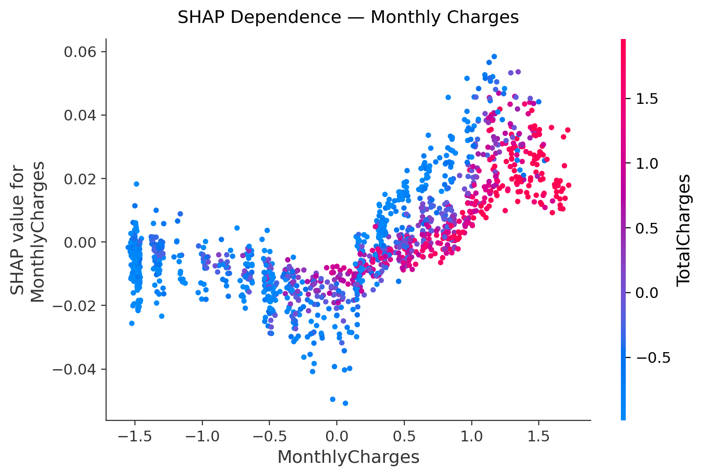

##### Tenure
Short-tenure customers cluster at positive SHAP values (churn-prone). The risk drops sharply after ~1 year and becomes protective beyond ~3 years:

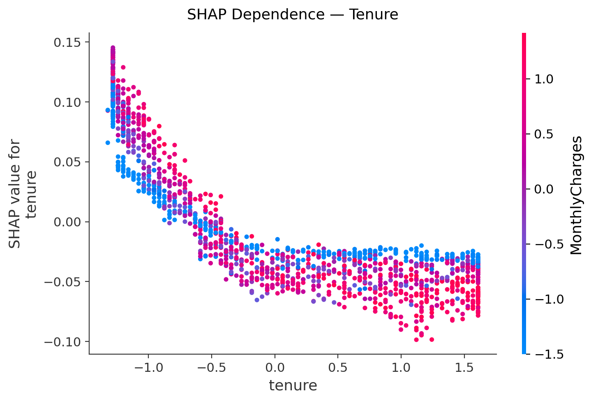

#### Cohort Analysis: Churned vs Retained

Side-by-side comparison of mean |SHAP| values for customers who actually churned versus those who stayed. This reveals which features the model uses differently for each group:

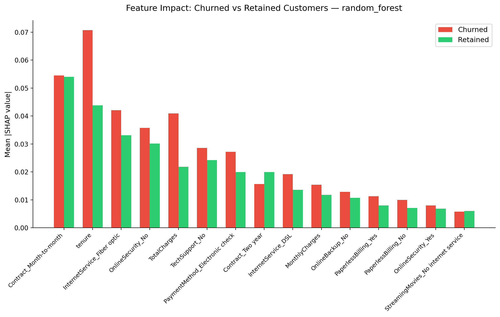

**Insight:** Tenure and TechSupport_No have the largest gap between churned and retained cohorts, meaning these features are the strongest discriminators the model relies on.

#### Local Explanation — Individual Customer

Waterfall plot for the highest-confidence true churner (Customer #1109), showing exactly how each feature contributed to their churn prediction (f(x) = 0.899):

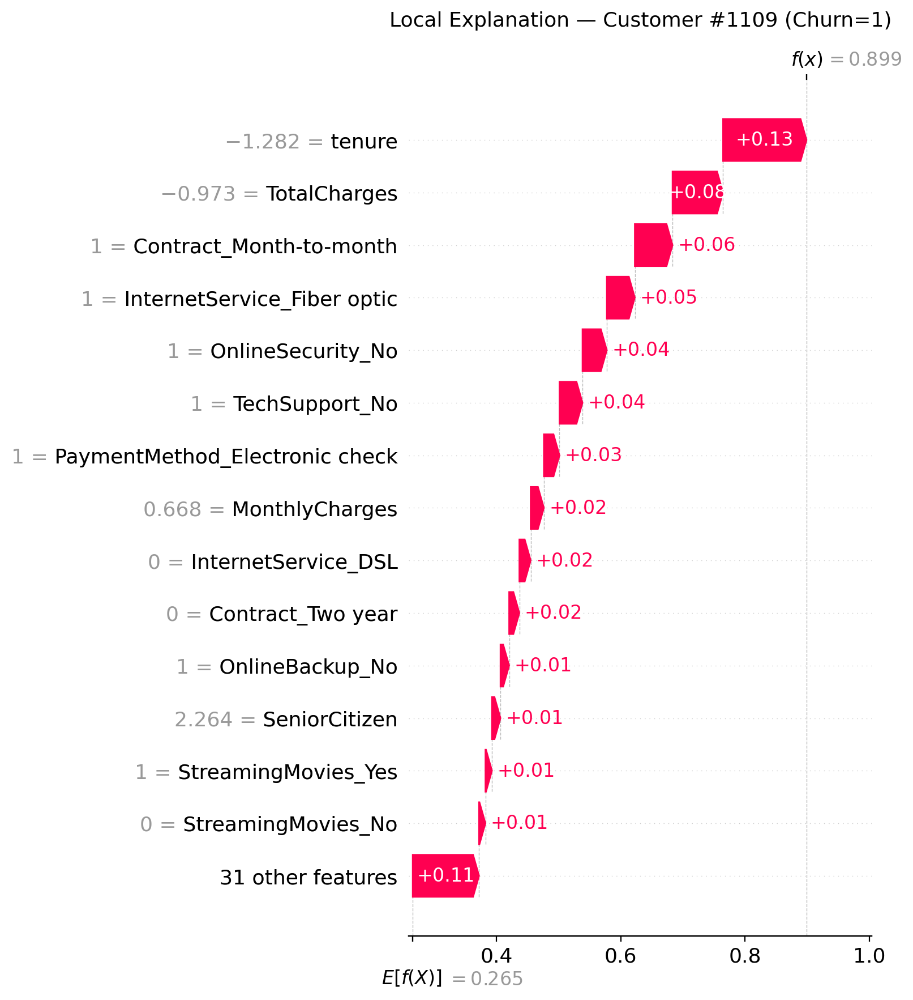

This customer had: low tenure (-1.28σ), month-to-month contract, fiber optic internet, no online security, no tech support — all pushing the prediction toward churn.

> Interactive HTML force plots for individual and full test-set explanations are available in `reports/random_forest_shap/`.

#### Running SHAP Explanations

```bash
make explain MODEL=random_forest
# or directly:
python -m churn.cli explain --model_name random_forest --top_n 15
```

#### Business Recommendations from SHAP Analysis

1. **Target fiber optic subscribers** with proactive retention campaigns — they churn at disproportionately higher rates
2. **Incentivize long-term contracts** — month-to-month customers are the highest-risk segment
3. **Focus on the first 12 months** — the tenure dependence plot shows a critical retention window
4. **Bundle security and tech support** — absence of these add-ons correlates strongly with churn
5. **Review fiber optic pricing** — the MonthlyCharges dependence plot suggests price sensitivity, especially among newer customers
